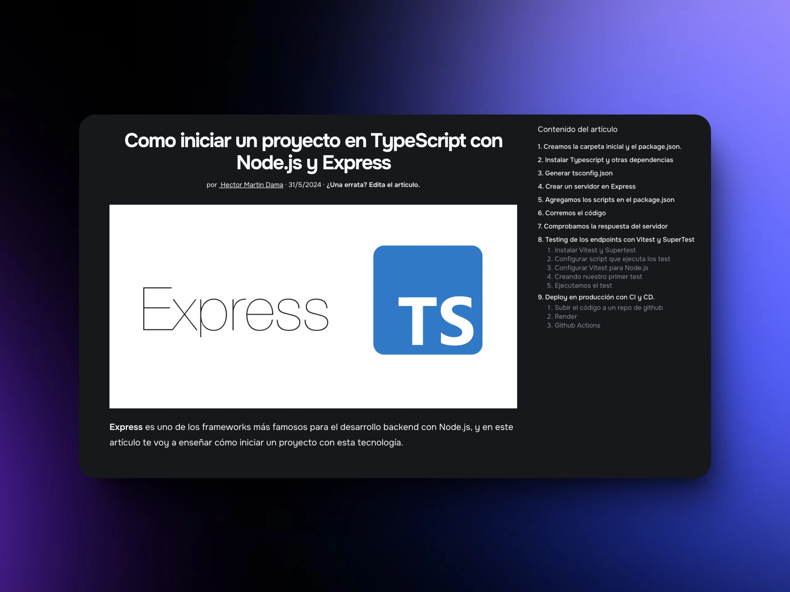

<div align="center">
<a href="https://blog-hectormartindama.vercel.app/es/">

</a>
<p></p>
</div>


<div align="center">


</div>

## 🛠️ Stack

- [**Astro**](https://astro.build/) - Framework for Static Pages
- [**i18n by Astro**](https://docs.astro.build/en/recipes/i18n/) - Support multilangue
- [**Utteranc**](https://utteranc.es/), [`blog-comments repository`](https://github.com/HectorMartinDama/blog-comments) - Issues as comments
- [**TypeScript**](https://www.typescriptlang.org/) - JavaScript with syntax for types
- [**Tailwdindcss**](https://tailwindcss.com/) - CSS Framework
- [**Tailwindcss-typography**](https://tailwindcss-typography.vercel.app/) - Plugin to markdown
- [**Vercel OG (Open Graph Image Generation)**](https://vercel.com/docs/functions/og-image-generation) - Open Graph Image Generation
- [**Sonner**](https://sonner.emilkowal.ski/) - Notifications

## 🚀 Project Structure

Inside of your Astro project, you'll see the following folders and files:

```text
/
├── public/
├── src/
│   └── pages/
|   └── content/blog
|      └── en/
|      └── es/
└── package.json
```

## 🧞 Commands

All commands are run from the root of the project, from a terminal:

| Command                   | Action                                           |
| :------------------------ | :----------------------------------------------- |
| `npm install`             | Installs dependencies                            |
| `npm run dev`             | Starts local dev server at `localhost:4321`      |
| `npm run build`           | Build your production site to `./dist/`          |
| `npm run preview`         | Preview your build locally, before deploying     |
| `npm run astro ...`       | Run CLI commands like `astro add`, `astro check` |
| `npm run astro -- --help` | Get help using the Astro CLI                     |

## ✌️ Contributing

> [!IMPORTANT]
> If you want to contribute go to the file [`CONTRIBUTING.md`](https://github.com/HectorMartinDama/blog/blob/main/CONTRIBUTING.md)

<a href="https://github.com/HectorMartinDama/blog/graphs/contributors">
  
</a>

<p></p>
